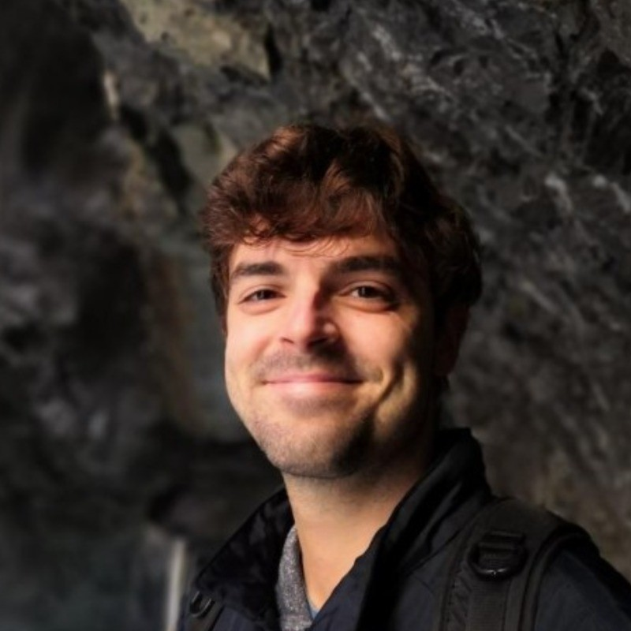

# Stefan Dvoretskii

Location: Heidelberg, Germany

<a href="stefan.dvoretskii@tum.de">Email: stefan.dvoretskii@tum.de</a> 
   
  Phone: +4591463375
   
<a href="https://www.linkedin.com/in/stefan-dvoretskii-03b183131/">LinkedIn: https://www.linkedin.com/in/stefan-dvoretskii-03b183131/</a>
    
  <a href="https://github.com/stefanches7">GitHub: stefanches7</a>
 

 
### Research Interests

Large Language Models, Machine-actionable Datasets, Organoid Intelligence, Neuroengineering, Computational Biology, Bioinformatics, Computational Modelling, Dynamical Systems, Science Communication, International Collaboration

## Work experience

`11.2023-currently`
__Research Data Architect | German Cancer Research   Center, Heidelberg__ 
- Working on cutting-edge research in metadata and AI

`04.2023-10.2023`
__Master Thesis Spiking Neural Networks | University of Barcelona, Spain__ 
- Plausible SNN model of in vitro 2D neuronal networks connectivity changes
- Save up to €6,000 per experiment through computer simulation

`13.07.2022-30.09.2022`	
__Internship in brain imaging | Georgia State   University (Dr. Cyrus Eierud), USA__ 
- Demo of GIFT package (MATLAB, fMRI)

`03.07.2022-02.09.2022`
__Internship in NeuCHiP - Neural cultures based AI |  Prof. Dr. David Saad, Aston, UK__ 
- Computing in biological neural networks

`09.04.2021-31.07.2021`
__Application Engineer | Mentalab, Munich__ 
- EEG hardware production, Computational Modelling, Brain-Computer Interfaces, EEG data analysis, MATLAB

`01.10.2020-31.03.2021`
__Working Student IT | STABL GmbH, Munich__ 
- Electrical multimodal battery system metrics

`01.2018-09.2020`
__Student Undergraduate Researcher | Chair for Computational Biology, Technical University of Munich (Prof. Dr. Julien Gagneur)__ 
- Biological Modelling, Expression Data analysis, Bachelor's Thesis

`05.2017-08.2017`
__Google Summer of Code '17 Student | European Bioinformatics Institute, EMBL, Cambridge, UK__ 
- Files search API with a web interface (Javascript, React.js, Perl, HTML/CSS)

`01.2017-08.2017`	 
__Student Developer | Omikron Data Quality GmbH, Berlin__ 
- JavaGWT, Jenkins, CI/CD

`10.2016-11.2016`	
__Junior Project Manager | Deutsche Payment GmbH (Berlin) and Upnext Technologies Sp. z o.o. (Warsaw)__ 
- Ruby on Rails, Go

## Education

`10.2020-09.2023`
__Elite M. Sc. Neuroengineering__ in Elite Network of Bavaria,  __TU Munich__
- • Average grade: __2,2__ (best – 1,0; worst – 5,0)
- • Thesis: SNN model of in vitro 2D neuronal networks, saving up to €6,000 per experiment through computer simulation.
- • _Stays abroad_: HKUST, Hong Kong (Aug 2022 - Jan 2023); DTU, Denmark (Jan 2023 - June 2023); Uni Barcelona (June 2023 - Oct 2023)

`10.2017-09.2020`
__B.Sc. Bioinformatics__ at the TU Munich/LMU Munich   (joint study program)
- • Average grade: __1,9__ (best – 1,0; worst – 5,0)
- • Thesis: SARS-CoV-2 variants in RNASeq data, facilitating the investigation of communal infection in hospitals.

## Skills and Hobbies 

### Languages 

German (fluent), English (fluent), Latin (GOLD ELEX), Ancient Greek (BRONZE ELEX), Russian (mother tongue), Ukrainian (mother tongue), Chinese (A2.1), Danish (beginner), Bulgarian (beginner)

### Music instruments

Violin (good), piano, ukulele, domra, guitar (bearable)

### Hobbys

Reading, Philosophy, Psychology, Basketball, Programming, listening to music, riding a bike, walking

_Last updated: February 2025_

