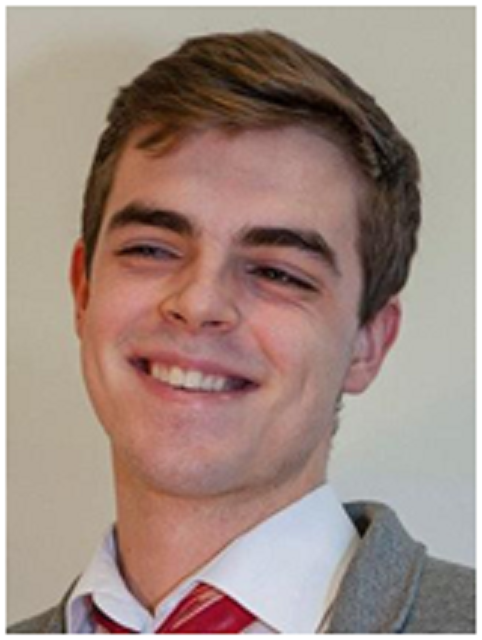

# Stefan Dvoretskii

Aspiring PhD student in biology and computational properties of Brain Organoids

<a href="stefan.dvoretskii@tum.de">Email: stefan.dvoretskii@tum.de</a>
| <a href="http://linkedin.com/stefan-dvoretskii-03b183131">LinkedIn: stefan-dvoretskii-03b183131</a>
  |   <a href="https://github.com/stefanches7">GitHub: stefanches7</a>
  |  <a href="https://steved.netlify.app">Website: steved.netlify.app</a>
  |   <a href="https://stefanches7.github.io/markdown-cv/">CV: https://stefanches7.github.io/markdown-cv/</a>
 

### Specialized in

Brain Organoids, Sequencing data, Biological Imaging, Computational Modelling, Dynamical Systems

### Research interests

Synaptic Plasticity in Neural Cell Colonies, Structural and Functional Connectivity, Development of Brain Tissue in vitro

## Education

`09.2009–06.2016`
__Classical Gymnasium №610__, Saint Petersburg, Russian Federation
- Focus on _Latin, Math, Ancient Greek_

`09.2016-06.2017`
__Studienkolleg TU Berlin__, T (Technik) course
- Grade: __1,2__ (best – 1,0; worst – 5,0)

`10.2017-09.2020`
__B.Sc. Bioinformatics__ at the TU Munich/LMU Munich   (joint study program)
- Final thesis: _“Origins and Effects of Mutations in SARS-CoV-2   Genome”_ (Prof. Dr. Julien Gagneur)
- Average grade: __1,9__ (best – 1,0; worst – 5,0)

`10.2020-ongoing`
__Elite M. Sc. Neuroengineering__ in Elite Network of Bavaria,  __TU Munich__
- Final thesis: _"Structural and functional connectivity in neuronal   cell cultures"_ (Prof. Dr. Ruben Portugues (TUM),   Prof. Dr. Jordi Fradera (Uni Barcelona))
- Average grade: __2,2__ (best – 1,0; worst – 5,0)

## Work experience

`06.2016-08.2016`	
Internship at the __State University of Saint-Petersburg, Laboratory of Physiological Genetics__
- ◦ Prions co-culturing (Molecular Biology, Yeast)

`10.2016-11.2016`	
Junior Project Manager at __Deutsche Payment GmbH (Berlin)__ and __Upnext Technologies Sp. z o.o. (Warschau)__ 
- ◦ Ruby on Rails, Go

`01.2017-08.2017`	 
Student Developer at __Omikron Data Quality GmbH__ 
- ◦ JavaGWT, Jenkins, CI/CD

`05.2017-08.2017`
Google Summer of Code '17 Student with __European Bioinformatics Institute, EMBL__, Cambrige, UK
- ◦	Files search API with a web interface (Javascript, React.js,   Perl, HTML/CSS)

`01.2018-09.2020`
Student Undergraduate Researcher at the __Chair for Computational Biology__ (now Computational Medicine), Technical University of Munich
- ◦	Biological Modelling, Expression Data analysis, Bachelor's Thesis

`05.2019-08.2019`
Google Summer of Code '19 Student with __International Neuroinformatics Coordination Facility__, Dr. Bradly Alicea
- ◦	An _embodied cognitive simulation_ with _evolutionary development   of neural networks_ with a _guided user interface_

`16.10.2019-14.02.2020`
__Data Analysis and Visualization in R tutor__, Technical University of Munich

`01.10.2020-31.03.2021`
Working Student IT at __STABL GmbH__
- ◦	Electrical multimodal battery system metrics	

`09.04.2021-31.07.2021`
Application Engineer at __Mentalab__
- ◦ EEG hardware production, Computational Modelling,  Brain-Computer Interfaces, EEG data analysis, MATLAB

`15.08.2021-15.06.2022`
Student Research Assistant at PainLab Munich
- ◦	EEG connectivity in pain patients (MATLAB)

`03.07.2022-02.09.2022`
Internship in __NeuCHiP__ - Neural cultures based AI   (Prof. Dr. __David Saad__, Aston, UK)
- ◦	Computing in biological neural networks

`13.07.2022-30.09.2022`	
Internship in brain imaging with   __Georgia State University__ (Dr. Cyrus Eierud)
- ◦	Demo of __GIFT__ package (MATLAB, fMRI)

## Awards & Fellowships

`School exchange`	 
__Woodbridge School__, Woodbridge, Suffolk, Great Britain

`Fellowship`	
Motivation stipend of the __TU Berlin__, 09.2016 - 07.2017 - 3000€

`Fellowship`	
Student Stipend for __Google__ Summer of Code participants, Summer 2017 - 6000$
 
`Fellowship`	
__BayBIDS__ motivation stipend, 11.2017-10.2018 - 3300€

`Fellowship`
__Hans-Rudolf__-Stiftung, 10.2018-10.2023 - 10500€

`Fellowship`
Stipend for __Google__ Summer of Code participants, Summer 2019 - 4600$

`Fellowship`
__INCF & Mathworks__ Summer of Code participants, 07.2022-10.2022 - 3000$

`Exchange`
Hong Kong University of Science and Technology, Fall 2022

`Fellowship`
BayCHINA, Bavarian-Chinese mobility fellowship, Fall 2022 - 1200€

`Exchange`
Technical University of Denmark, Copenhagen, Spring 2023

`Fellowship`
__Erasmus+__ mobility, Spring 2023 - 3400€

## Engagement
`Collaborator`	
__NeuroSim__ interests group
- ◦	Cognitive Science, AI, Neurobiology and Computation

`Member`	
AGV Academic Choral Society, Munich
- ◦	Choir & orchestra (violin), event organization, cultural activities

## Publications

`2022`
__Dvoretskii, Stefan, et al.__ "Braitenberg vehicles as developmental neurosimulation." Artificial Life 28.3 (2022): 369-395.

`in preparation`  
Wachutka L., Dvoretskii S., Gagneur J. et al. wBuild – build system for R reports.

### Attended events highlights
- __Neuroinformatics 2019__, 1-2 September in Warsaw, Poland 
- __Brainhack__: 2019 Geneva, Marburg; 2021 Geneva, Marseille
- __Siemens Innovation__ Think Tank Healthineers Workshop 2021, online
- __TUM Business Game__, 28.-30. April 2022, Munich
- Bridging Physics with Neuroscience and Machine Learning Symposium,   6. December 2022, Hong Kong SAR, China
- __EBRAINS__ CoCreate – Digital Roadmap for Neuropsychiatric Diseases,  1.-3. March 2023, Copenhagen, Denmark & online
- __EBRAINS__ PFC Workshop, 14.-16. March 2023, Paris, France
- __FENS-IBRO Brain Conference__ “Establishment and Maintenance of   Brain Cell States”, poster & flash talk, 23.-26. April 2023, Copenhagen, Denmark 

## Skills and Hobbies 

### Languages 

German (fluent), English (fluent), Latin (GOLD ELEX), Ancient Greek (BRONZE ELEX), Russian (mother tongue), Ukrainian (mother tongue), Chinese (A2.1), Danish (beginner), Bulgarian (beginner)

### Music instruments

Violin (good), piano, ukulele, domra, guitar (bearable)

### Hobbys

Reading, Philosophy, Psychology, Basketball, Programming, listening to music, riding a bike, walking

_Last updated: April 2023_

